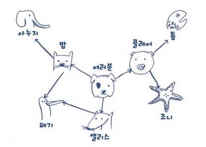
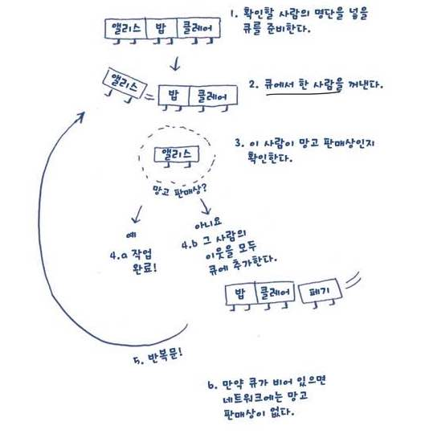
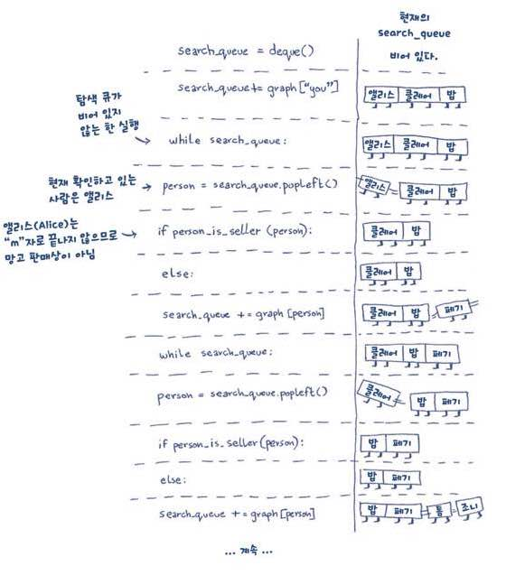

# 6week 발표자료 너비우선탐색
#study/algorithm

너비 우선탐색이 도움이 되는 경우
- 정점A에서 정점B로 가는경로가 존재하는가?
- 정점A에서 정점B로 가는 **최단 경로**는 무엇인가?

## 최단 경로 찾기 예시:  망고 판매상 찾기
> 나는 망고 농장의 주인, 지금부터 페북을 통해 망고 판매상을 찾는다! ~~다단계인가~~
- 내 친구 리스트 `[앨리스, 밥, 클래어]`
- 각각 순회하며 망고판매상인지 확인 
	- 앨리스는 망고 판매상? [예:끝, 아니오]
	- …
- 내 친구중에 망고판매사아 없움 -> 친구의 친구를 찾자
	- 앨리스 친구: `[밥, 클래어, 페기]`
		- 밥(클래어, 페기)은 망고 판매상? [예:끝, 아니오]
- 나는 3촌보단 2촌, 2촌 보단, 1촌 가까운 관계인게 좋다! -> **너비 우선 탐색** 하시오
- -> 1촌 2촌 3촌 순서대로 대기열에 추가해서 탐색해야함 => **큐** 사용

## 큐
> 버스정류장에 줄서는 것 (먼저 기다리고 먼저 탐)

## 그래프로 구현해보자



```python
graph = {}
graph['you'] = ['elice', 'bob', 'claire']  # 내 1촌
graph['bob'] = ['anuj', 'peggy']
graph['elice'] = ['peggy']
graph['claire'] = ['thom', 'jonny']
graph['peggy'] = []
graph['thom'] = []
graph['jonny'] = []
graph['anuj'] = []
```

- 해시테이블은 순서를 가지지 않아서 저 리스트안에 사람들 어떤 순서인지 상관없음
- **방향 그래프** 임



```python
from collections import deque

graph = {}
graph['you'] = ['elice', 'bob', 'claire']  # 내 1촌
graph['bob'] = ['anuj', 'peggy']
graph['elice'] = ['peggy']
graph['claire'] = ['thom', 'jonny']
graph['peggy'] = []
graph['thom'] = []
graph['jonny'] = []
graph['anuj'] = []
search_queue = deque()

search_queue += graph['you']


def person_is_seller(name):
    """
    이름이 m으로 끝나면 망고판매상
    """
    return name[-1] == 'm'


while search_queue:
    person = search_queue.popleft()
    if person_is_seller(person):
        print(f'{person} is a mango seller!')
        break
    else:
        search_queue += graph[person]
```
- `while` 문 종료 조건
	- 망고판매상 발견하거나
	- queue가 비거나
	


## 버그발견: 이 코드의 치명적인 문제가 무엇일까요?


-> while문이 영원히 안 끝날 수 있다!
- 내 친구가 페기고 페기 친구도 나인 경우
- 버그 고친 코드
```python
from collections import deque

graph = {}
graph['you'] = ['elice', 'bob', 'claire']  # 내 1촌
graph['bob'] = ['anuj', 'peggy']
graph['elice'] = ['peggy', 'you']  # 내 친구 앨리스의 목록에 나도 있음 -> 무한 순환 발생
graph['claire'] = ['thom', 'jonny']
graph['peggy'] = []
graph['thom'] = []
graph['jonny'] = []
graph['anuj'] = []


def person_is_seller(name):
    """
    이름이 m으로 끝나면 망고판매상
    """
    return name[-1] == 'm'


def search(name):
    search_queue = deque()
    search_queue += graph[name]
    searched = []  # 이미 확인한 사람 추가하는 리스
    while search_queue:
        person = search_queue.popleft()
        if person not in searched and person_is_seller(person):  # person이 searched 에 있는지 확인하는 조건 추가
            print(f'{person} is a mango seller!')
            break
        else:
            search_queue += graph[person]
            searched.append(person)


if __name__ == '__main__':
    search('you')
```

## 실행 시간
- 망고 판매상을 찾기 위해 전체 친구 네트워크 탐색 -> 모든 정멎을 따라 움직인다는 뜻
- 실행 시간: `O(간선의 개수)`
- + 큐에 사람을 추가하는 시간 `O(1)`  -> 모든 사람에 이것을 작용하면 `O(사람의 수)` 시간
- => 따라서 너비 우선탐색은:  `O(사람의 수 + 간선의 수)`  = `O(V+ E)`
	- V: 정점의 수
	- E: 깐선의 수 

